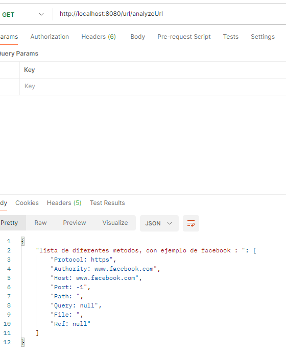
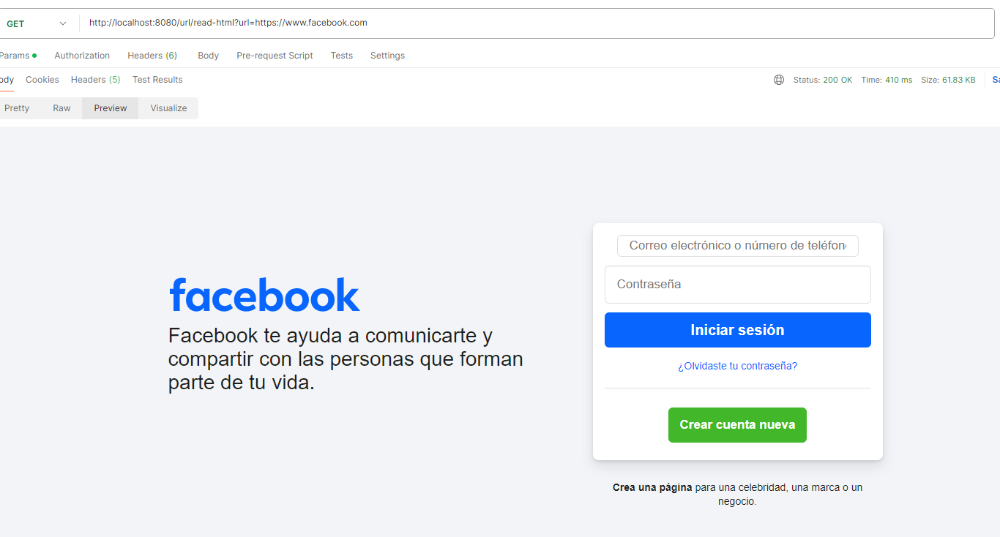
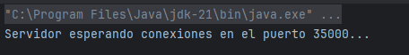
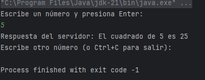

# Networking

## Introducción

Este proyecto implementa una sencilla aplicación cliente-servidor utilizando **sockets TCP en Java**. El objetivo principal es practicar la comunicación entre procesos mediante sockets, enviando datos desde un cliente hacia un servidor que procesa esa información y devuelve una respuesta.

---

## Reconocimiento

Parte de los contenidos y códigos de este taller están basados en los tutoriales oficiales de Java sobre networking, disponibles en:  
https://docs.oracle.com/javase/tutorial/networking/index.html

---

## Conceptos básicos de redes

Los programas que se comunican a través de internet utilizan generalmente dos protocolos principales:

### 1. TCP (Transmission Control Protocol)

TCP es un protocolo orientado a conexión que provee una comunicación confiable entre dos computadoras. Mantiene el orden de los paquetes de datos y garantiza que todos los datos se entreguen correctamente y en orden.

### 2. UDP (User Datagram Protocol)

UDP es un protocolo sin conexión que envía los datos en paquetes llamados datagramas. No garantiza la entrega ni el orden de los paquetes, por lo que es más rápido pero menos confiable que TCP.

### 3. ¿Qué son los puertos?

Un computador generalmente tiene una única conexión física a internet, pero puede ejecutar múltiples aplicaciones que utilizan la red simultáneamente. Para que los datos se dirijan a la aplicación correcta, cada programa que recibe datos en la red se asigna a un número lógico llamado **puerto**.

Los puertos son enteros de 16 bits con rango de 0 a 65,535. Los puertos entre 0 y 1023 están reservados para servicios específicos (por ejemplo, el puerto 80 para servidores web).

Los protocolos TCP y UDP usan estos puertos para enviar y recibir datos hacia las aplicaciones adecuadas.

---


## Ejercicios

## 3. Uso de URL en Java

### 3.1 Leyendo los valores de un objeto URL

El programador puede usar varios métodos para leer la información de un objeto `URL`:  
`getProtocol`, `getAuthority`, `getHost`, `getPort`, `getPath`, `getQuery`, `getFile`, `getRef`.

#### ✅ Solución al Ejercicio 1

Se creó una clase de servicio (`UrlServiceImpl`) que implementa la lógica para analizar una URL usando estos métodos, y expone la información a través de un endpoint REST:

```java
URL url = new URL("https://www.facebook.com");

componentes.add("Protocol: " + url.getProtocol());
componentes.add("Authority: " + url.getAuthority());
componentes.add("Host: " + url.getHost());
componentes.add("Port: " + url.getPort());
componentes.add("Path: " + url.getPath());
componentes.add("Query: " + url.getQuery());
componentes.add("File: " + url.getFile());
componentes.add("Ref: " + url.getRef());
```

### 🔍 Endpoint para analizar URL

`GET /url/analyzeUrl`  
Devuelve un JSON con los componentes extraídos de una URL de ejemplo (`https://www.facebook.com`).


---

### 3.2 Leyendo páginas de internet

Para leer páginas de internet se usan flujos de datos (`BufferedReader`) y se trata la entrada como si se leyera desde el teclado.

#### ✅ Solución al Ejercicio 2

Se implementó un método `readHtml` que:

- Pide al usuario una dirección URL.
- Crea un stream de entrada con esa URL.
- Guarda el contenido HTML en memoria.
- Lo devuelve como respuesta HTML al cliente.

---

### 🔍 Endpoint para leer una página web

`GET /url/read-html?url=ejemplo.com`  
Recibe una URL como parámetro y devuelve su contenido HTML. Por ejemplo:



Devuelve el html completo de la pagina por ejemplo (`https://www.facebook.com`).


## 3.2 Leyendo páginas de internet

Para leer páginas de internet debe crear flujos de datos (streams) y leer como si lo hiciera del teclado.  
El ejemplo siguiente lee datos de internet y los presenta en la pantalla (fig. 1).

### EJERCICIO 2

Escriba una aplicación `browser` que pregunte una dirección URL al usuario y que lea datos de esa dirección y los almacene en un archivo con el nombre `resultado.html`.  
Luego intente ver este archivo en el navegador.


## Ejercicio 3

Esta parte contiene dos partes

### Servidor (`SquareServer.java`)

- Escucha conexiones entrantes en el puerto 35000.
- Recibe un número enviado por el cliente.
- Calcula el cuadrado del número recibido.
- Envía el resultado de vuelta al cliente.
- Maneja entradas inválidas respondiendo con un mensaje de error.



### Cliente (`EchoClient.java`)

- Se conecta al servidor en `localhost` y puerto 35000.
- Permite al usuario ingresar números desde la consola.
- Envía el número al servidor.
- Muestra la respuesta recibida (el cuadrado calculado o mensaje de error).
- Permite enviar múltiples números hasta que el usuario decida cerrar.



---

## Cómo ejecutar

1. Compilar ambos programas (desde la carpeta raíz, considerando la estructura de paquetes si aplica):

```bash
javac com/edu/escuelaing/arsw/networking/Networking/sokets/SquareServer.java
javac com/edu/escuelaing/arsw/networking/Networking/sokets/EchoClient.java
```

## Ejercicio 4

Escriba un servidor web que soporte multiples solicitudes seguidas (no concurrentes). El servidor debe retornar todos los archivos solicitados, incluyendo
paginas html e im´agenes.

# Servidor Web en Java

Este proyecto implementa un servidor web básico en Java que soporta múltiples solicitudes seguidas (no concurrentes) y sirve archivos estáticos como páginas HTML e imágenes.

## Características

- Soporte para múltiples conexiones una tras otra (no simultáneas).
- Sirve archivos estáticos desde la carpeta `public`.
- Respuesta automática para archivos `.html`, `.jpg`, `.png`, `.gif`, `.css`, `.js`, etc.
- Respuesta 404 si el archivo no se encuentra.

## Instrucciones

1. Coloca tus archivos estáticos en la carpeta `public`.
2. Compila el servidor:

```bash
javac HttpServer.java
```

```bash
java HttpServer
```

Abre tu navegador en: http://localhost:35000
Ejecutar en el servidor:


